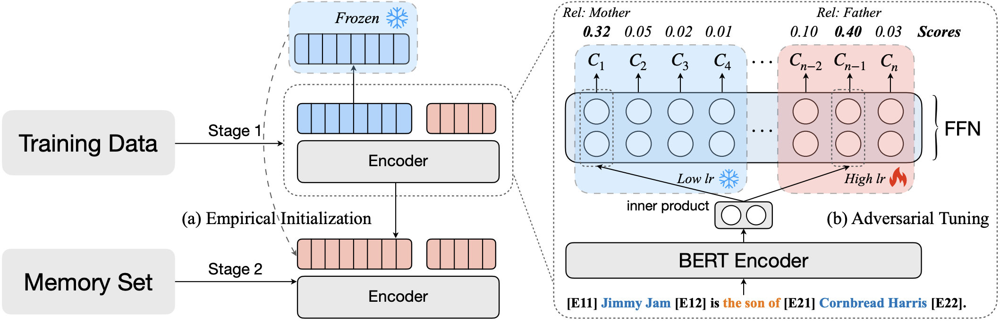

# Classifier Decomposition

Codes for our paper "[Enhancing Continual Relation Extraction via Classifier Decomposition](https://aclanthology.org/2023.findings-acl.638.pdf) (Findings of ACL2023). In this paper:

- We find that CRE models suffer from classifier and representation biases when learning the new relations. 
- We propose a simple yet effective classifier decomposition framework with empirical initialization and adversarial tuning to alleviate these two biases.
- Extensive experiments on FewRel and TACRED verify the effectiveness of our method.



# Environment

- Python >= 3.7
- Torch >= 1.5.0

```
conda create -n cdec python=3.8
conda activate cdec
pip install -r requirements.txt
```


# Dataset

We use two datasets in our experiments, `FewRel` and `TACRED`:

- FewRel: `data/data_with_marker.json`
- TACRED: `data/data_with_marker_tacred.json`

We construct 5 CRE task sequences in both FewRel and TACRED the same as [RP-CRE](https://aclanthology.org/2021.acl-long.20/) and [CRL](https://aclanthology.org/2022.findings-acl.268/).

# Run

```
bash ./bash/[dataset]/cdec.sh
    - dataset: the dataset name, e.g.,:
        - fewrel/tacred
```

## Note

This code is based on ACA [(https://github.com/Wangpeiyi9979/ACA)](https://github.com/Wangpeiyi9979/ACA).

# Citation

```
@inproceedings{Xia:2023CDec,
  author       = {Heming Xia and
                  Peiyi Wang and
                  Tianyu Liu and
                  Binghuai Lin and
                  Yunbo Cao and
                  Zhifang Sui},
  editor       = {Anna Rogers and
                  Jordan L. Boyd{-}Graber and
                  Naoaki Okazaki},
  title        = {Enhancing Continual Relation Extraction via Classifier Decomposition},
  booktitle    = {Findings of the Association for Computational Linguistics: {ACL} 2023,
                  Toronto, Canada, July 9-14, 2023},
  pages        = {10053--10062},
  publisher    = {Association for Computational Linguistics},
  year         = {2023},
  url          = {https://doi.org/10.18653/v1/2023.findings-acl.638},
  doi          = {10.18653/V1/2023.FINDINGS-ACL.638},
  timestamp    = {Thu, 10 Aug 2023 12:35:45 +0200},
  biburl       = {https://dblp.org/rec/conf/acl/XiaW0LCS23.bib},
  bibsource    = {dblp computer science bibliography, https://dblp.org}
}
```

